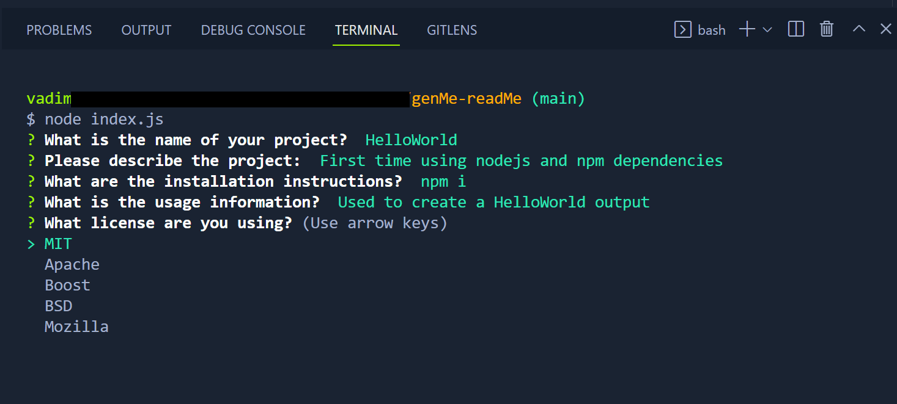
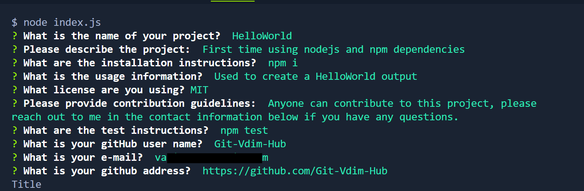

# genMe-readMe

## Description

This is a simple application that generates a readMe.md file for any project! The app runs in your command prompt after installing nodejs and running npm i in cli. I build this to help re-inforce foundational coding back-end knowledge using node and an npm library. During this project I got to work with the inquirer npm dependency, get a better grasp on the nodejs file system methods such as fs.writeFile()), use template literals, get a deeper understanding of package.json and package-lock.json and finally work with Javascript Special characters such as \n.

* [Installation](#installation)
* [Usage](#usage)
* [Credits](#credits)
* [License](#license)
* [Tests](#Tests)
## Installation

Please make sure you have nodejs installed then run the following command:
```
npm i
```

## Usage

Instructions and examples for use including screenshots and github repo/page.

- Click link to view repo: [Github Repo](https://github.com/Git-Vdim-Hub/genMe-readMe)
- Walk through [video](https://drive.google.com/file/d/1qPaBY7DtE7tYfHUMESCH-QEjW-2nMOGE/view)

- Screenshots




## Credits

This application was built with the use of [nodejs](https://nodejs.dev/en/) and the npm library 
[inquirer](https://www.npmjs.com/package/inquirer)
## License

[MIT](https://choosealicense.com/)

## Tests

Completed Basic Functionality Testing including making sure all badges and links display and work on the readMe file after output.